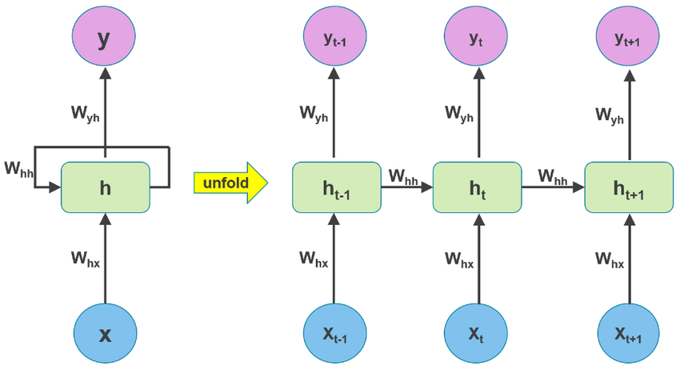

# AI Basics
**From Beginnings to Transformers**  
Angelika & Carsten  
TGIF 2024.10.25

---

## Introduction to AI
- AI = Machines simulating human intelligence
- Areas: Machine Learning, Natural Language Processing (NLP)
- Techniques: Cluster Analysis, Neural Networks

---

## Cluster Analysis
- Clustering: Grouping similar data points
- Techniques: K-Nearest Neighbors, k-means

---

## K-Nearest Neighbors (KNN)
- **Authors:** Evelyn Fix & Joseph Hodges (1951)
- Finds nearest neighbors, majority voting

---

## Early AI: Perceptron
- **Author:** Frank Rosenblatt (1957)
- Simple neural network for binary classification

---

## Neural Networks (NN)
- Mimics brain to recognize patterns
- Layers: Input, hidden, output
- Deep Learning: NN with many hidden layers

---

## Backpropagation
- Learning algorithm in NNs
- Adjusts weights

---

## Supervised  Learning
- Supervised: Labeled data

---

## Unsupervised Learning
- Unsupervised: Unlabeled data (clustering)

---

## Autoencoders
- Data compression, unsupervised learning

---

## Autoencoder: Deepfake

---

## GAN: Image generator
- GAN: Generative Adversarial Networks
- Two networks: Generator vs. Discriminator

  

---

## GAN in Action: 1
Learn how to paint a Horse ... start randomly

---

## GAN in Action: 2
Learn how to paint a Horse ... making progress

---

## GAN in Action: 3
Learn how to paint a Horse ... got it :)

---

## CNN
- CNN = Convolutional Neural Networks
- Designed for image processing

---

## RNN
- RNN = Recurrent Neural Networks
- Processes sequences, remembers last step
- Use cases: Time-series, NLP

---

## RNN: unfold
- Unfold over 3 time steps: t-1, t, t+1

---

## Transformers
- Self-attention mechanism
- Revolutionized NLP (GPT, BERT)
- Better than RNNs ... knows the context of the words

---

## No Data ... No AI
- Data: Essential for training models
- Quality & quantity affect performance

---

## References
- Janelle Shane. [You Look Like a Thing and I Love You](https://www.janelleshane.com/book-you-look-like-a-thing)
- Janelle Shane's blog: [AIWeirdness.com](https://www.aiweirdness.com)
- Inga Strümke. [Künstliche Intelligenz, Rheinwerk](https://www.rheinwerk-verlag.de/kuenstliche-intelligenz-wie-sie-funktioniert-und-was-sie-fuer-uns-bedeutet/)
- Pit Noak, Sophia Sanner. [Künstliche Intelligenz verstehen, Rheinwerk](https://www.rheinwerk-verlag.de/kuenstliche-intelligenz-verstehen-eine-spielerische-einfuehrung/)
