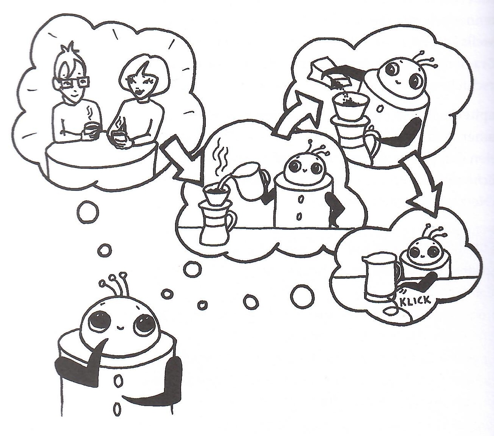

# Overview of Artificial Intelligence
## From the Beginnings to Transformers

Angelika & Carsten

TGIF 2024.10.25

---

## Introduction to AI
- **Definition of AI:** The ability of machines to perform tasks that typically require human intelligence.
- **Key areas of AI:** Machine Learning, Natural Language Processing, Robotics, etc.
- **Why AI matters today:** Its increasing role in automation, decision-making, healthcare, and more.

---

## Cluster Analysis
- **Definition:** Identifying groups of similar data points in a dataset.
- **History:** 
  - The concept of clustering has its roots in early statistical studies.
  - In the 1930s, R. C. Tryon applied clustering techniques to psychological data, marking one of the earliest uses.
  - The method gained momentum in the 1960s and 1970s with the development of algorithms like k-means (introduced by James MacQueen in 1967).
- **Techniques:** k-means, hierarchical clustering.
- **Use cases:** Customer segmentation, anomaly detection.
- **Visual:** Example of a cluster plot.

---

## K-Nearest Neighbors (KNN)
- **Definition:** A supervised learning algorithm for classification.
- **History:** Introduced by Evelyn Fix and Joseph Hodges in 1951.
- **How it works:** Finding the nearest 'k' neighbors and classifying based on majority.
- **Use cases:** Image recognition, recommendation systems.

---

## Early AI: The Perceptron
- Developed in 1957 by Frank Rosenblatt.
- The perceptron: the simplest form of a neural network used for binary classification.

---

## Neural Networks: Definition
- **What is a Neural Network (NN)?**
  - A series of algorithms that mimic the operations of a human brain to recognize patterns.
- **Basic architecture of a NN:** Input layer, hidden layers, output layer.

---

## Back-propagation in Neural Networks
- **Definition:** A learning algorithm used to train neural networks.
- **How it works:**
  - Gradually adjusts weights through gradient descent based on the error between predicted and actual output.
  - Propagates the error backward through the network.
- **Importance:** Enabled deep networks to learn efficiently.

---

## Neural Networks: Supervised vs. Unsupervised Learning
- **Supervised Learning:**
  - The model is trained with labeled data.
  - Example: Classification, regression.
- **Unsupervised Learning:**
  - The model works with unlabeled data, trying to find hidden patterns.
  - Example: Clustering, dimensionality reduction.

---

## Convolutional Neural Networks (CNNs)
- **Definition:** A type of NN specifically designed for processing grid-like data such as images.
- **Key concepts:** Convolution, pooling, fully connected layers.
- **Use cases:** Image recognition, video analysis, object detection.

---

## Recurrent Neural Networks (RNNs)
- **Definition:** A class of neural networks that use their internal state (memory) to process sequences of data.
- **Key concept:** Looping structure in RNNs to process temporal data.
- **Use cases:** Time-series analysis, natural language processing (NLP).
- **Visual:** RNN structure with loops.

---

## Autoencoders
- **Definition:** Unsupervised learning algorithm used for data compression and representation learning.
- **Structure:** Encoder compresses data, decoder reconstructs it.
- **Use cases:** Anomaly detection, image denoising, feature learning.

---

## Generative Adversarial Networks (GANs)
- **Definition:** A framework where two neural networks (generator and discriminator) compete with each other to generate realistic data.
- **How it works:** 
  - The generator creates fake data.
  - The discriminator tries to identify if the data is real or generated.
  - The generator improves over time by trying to fool the discriminator.
- **Use cases:** Image generation, data augmentation, deepfake creation.

---

## DALL-E

---

## Transformers
- **Definition:** A deep learning model that utilizes self-attention mechanisms to process sequential data.
- **How it revolutionized NLP:** Use in models like GPT, BERT.
- **Applications:** Text generation, translation, summarization.

---

## Importance of Data in AI
- **Data as the Foundation of AI:** 
  - Data is essential for training AI models to recognize patterns, make decisions, and solve problems.
- **Training Data:** 
  - The quality and quantity of data used to train a model greatly impact its performance.
  - **Supervised learning:** Requires labeled data.
  - **Unsupervised learning:** Works with unlabeled data, finds hidden patterns.
- **Data Challenges:**
  - **Overfitting:** When a model learns from noisy or irrelevant data.
  - **Bias in Data:** Poor quality or biased data can lead to unfair or inaccurate models.
- **Data Preprocessing:** Techniques like normalization, augmentation, and splitting (train/test) are used to improve the performance of models.

---

## Conclusion
- AI is a rapidly evolving field that began with basic models like the perceptron.
- Today, AI technologies like CNNs, RNNs, GANs, and Transformers are shaping innovations in various industries.
- **Future potential:** AGI (Artificial General Intelligence), ethical concerns, the role of AI in society.

---

## References
- Janelle Shane. [You Look Like a Thing and I Love You](https://www.janelleshane.com/book-you-look-like-a-thing)
- Janelle Shane's blog: [AIWeirdness.com](https://www.aiweirdness.com)
- Inga Strümke. [Künstliche Intelligenz, Rheinwerk](https://www.rheinwerk-verlag.de/kuenstliche-intelligenz-wie-sie-funktioniert-und-was-sie-fuer-uns-bedeutet/)
- Pit Noak, Sophia Sanner. [Künstliche Intelligenz verstehen, Rheinwerk](https://www.rheinwerk-verlag.de/kuenstliche-intelligenz-verstehen-eine-spielerische-einfuehrung/)
